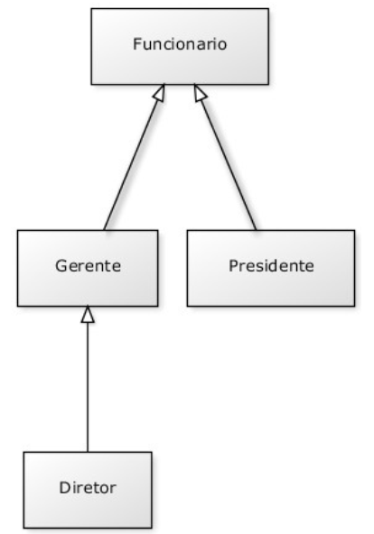

# CAPÍTULO 10 CLASSES ABSTRATAS
## 10.1 REPETINDO MAIS CÓDIGO?
Recordemos como pode estar nossa classe  Funcionario :
```java
public class Funcionario {
protected String nome;
protected String cpf;
protected double salario;
public double getBonificacao() {
return this.salario * 1.2;
      }
// outros métodos aqui
  }
```

Considere o nosso  ControleDeBonificacao :
```java
public class ControleDeBonificacoes {
private double totalDeBonificacoes = 0;
public void registra(Funcionario f) {
                System.out.println("Adicionando bonificação do funcionario: " + f);
this.totalDeBonificacoes += f.getBonificacao();
            }
public double getTotalDeBonificacoes() {
return this.totalDeBonificacoes;
            }
    }
```
Estamos utilizando aqui a classe  Funcionario  para o polimorfismo. Se não fosse ela, teríamos um
grande  prejuízo:  precisaríamos  criar  um método   registra   com  o  objetivo  de receber  cada  um  dos
tipos de  Funcionario , um para  Gerente , um para  Diretor , etc. 
Porém,  em  alguns  sistemas,  como  é  o  nosso  caso,  usamos  uma  classe  com  apenas  esses intuitos:
economizar  um  pouco  código  e  ganhar  polimorfismo  para  criar  métodos  mais  genéricos  que  se
encaixem em diversos objetos.
Faz sentido ter  uma referência  do tipo  Funcionario ? Essa  pergunta  é  diferente  de saber se faz
sentido ter um objeto do tipo  Funcionario : neste caso, faz, sim, e é muito útil.

Referenciando   Funcionario ,  temos  o  polimorfismo  de  referência,  já  que  podemos  receber
qualquer  objeto  que  seja  um   Funcionario .  Porém,  dar   new   em   Funcionario   pode  não  fazer
sentido, isto é, não queremos receber um objeto do tipo  Funcionario , mas, sim, que aquela referência
seja ou um  Gerente , ou um  Diretor , etc. Algo mais concreto que um  Funcionario .
```java
    ControleDeBonificacoes cdb = new ControleDeBonificacoes();
    Funcionario f = new Funcionario();
    cdb.adiciona(f); // faz sentido?
```

Vejamos um outro caso em que não faz sentido ter um objeto daquele tipo, apesar da classe existir:
imagine a classe  *Pessoa*  e duas filhas,  *PessoaFisica*   e   *PessoaJuridica* . Quando  puxamos  um
relatório de nossos clientes (uma array de  Pessoa , por exemplo), queremos que cada um deles seja ou
uma  *PessoaFisica*  ou uma  *PessoaJuridica* . A  classe  *Pessoa* ,  nesse  caso,  estaria sendo  usada
apenas para ganhar o polimorfismo e herdar algumas coisas: não faz sentido permitir instanciá-la.
Para resolver esses problemas, temos as **classes abstratas**.

## 10.2 CLASSE ABSTRATA
O que exatamente vem a ser a nossa classe  Funcionario ? Ela  é  uma  classe  que  apenas  idealiza  um  tipo,  define  somente  um
rascunho
Utilizamos a palavra-chave  *abstract*  para impedir que ela possa ser instanciada. Esse é o efeito
direto de se usar o modificador  *abstract*  na declaração de uma classe:
```java
public abstract class Funcionario {
protected double salario;
public double getBonificacao() {
return this.salario * 1.2;
        }
// outros atributos e métodos comuns a todos Funcionarios
    }
```
E no meio de um código:
```java
Funcionario f = new Funcionario(); // não compila!!!

```


O código acima não compila. O problema é instanciar a classe – criar referência você pode. Se ela
não pode ser instanciada, para que serve? Serve para o polimorfismo e herança dos atributos e métodos,
que são recursos muito poderosos, como já vimos.
Então, herdemos essa classe reescrevendo o método  getBonificacao :
```java
public class Gerente extends Funcionario {
public double getBonificacao() {
return this.salario * 1.4 + 1000;
        }
    }
```


## Classe Abstrata
É um tipo de classe especial que não pode ser instanciada, apenas herdada. Sendo assim, uma classe abstrata não pode ter um objeto criado a partir de sua instanciação. Essas classes são muito importantes quando não queremos criar um objeto a partir de uma classe “geral”, apenas de suas “subclasses”.

Imagine que possuímos três classes (Conta, Conta Corrente e Conta Poupança), sendo a classe Conta uma classe “geral” (comumente chamada de classe “pai”). Ao ir em um banco, nós não criamos uma nova Conta, mas sim uma Conta Corrente ou uma Conta Poupança.

Sendo assim, não faz sentido que a classe Conta possa ser instanciada, já que é um erro na regra de negócio caso isso ocorra. É aí que entra o termo “abstrato” desse tipo de classe, por não haver a necessidade de criar objetos com base em uma classe “pai”, não há porquê ela permitir a instanciação de novos objetos.

**Por não permitir a instanciação de novos objetos com base em uma classe abstrata, este tipo de classe é utilizada para implementar o conceito de Herança da OO. Ou seja, as classes abstratas irão armazenar atributos e métodos comuns às classes que a irão herdar, permitindo um maior reaproveitamento de código.**

## 10.3 MÉTODOS ABSTRATOS

Se o método  getBonificacao  não fosse reescrito, ele seria herdado da classe mãe, fazendo com
que devolvesse o salário mais 20%.
Levando  em  consideração  que  cada  funcionário  em  nosso  sistema  tem  uma  regra  totalmente
diferente a fim de ser bonificado, faz algum sentido ter esse método na classe  Funcionario ?
Parece que não, cada classe filha terá
um método diferente de bonificação, pois, de  acordo  com nosso sistema, não  existe uma regra geral

Em  Java,  existe  um recurso  no  qual,  em  uma  classe  abstrata,  podemos  escrever  que  determinado
método será sempre escrito pelas classes filhas. Isto é, um método abstrato

### COMO DECLARAR UM MÉTODO ABSTRATO
Às vezes, não fica claro como declarar um método abstrato.
Basta escrever a palavra-chave  abstract  na sua assinatura e colocar um ponto e vírgula em
vez de abrir e fechar chaves!

```java
public abstract class Funcionario {
public abstract double getBonificacao();
// outros atributos e métodos
    }
```

Repare que não colocamos o corpo do método e usamos a palavra-chave  abstract  para defini-lo.
Por que não colocar corpo algum? Porque esse método nunca será chamado.

O método do  ControleDeBonificacao  estava assim:
```java
public void registra(Funcionario f) {
        System.out.println("Adicionando bonificação do funcionario: " + f);
this.totalDeBonificacoes += f.getBonificacao();        
    }
```
Como posso acessar o método  getBonificacao  se ele não existe na classe  Funcionario ?

Já  que  o  método  é  abstrato,  com  certeza  suas  subclasses  têm  esse  método,  garantindo  que  essa
invocação de método não falhará. Se não o código nem compilava

## 10.4 AUMENTANDO O EXEMPLO

E se, no nosso  exemplo de  empresa, tivéssemos o próximo diagrama de  classes com os seguintes
métodos:

Essas classes compilarão? Rodarão?
A resposta é sim. E, além de tudo, farão exatamente o que nós queremos, pois quando  Gerente  e
 Presidente  têm  os métodos perfeitamente implementados,  a  classe  Diretor ,  a  qual  não  os tem,
**usará a implementação herdada de  Gerente**


E  esse  diagrama  em  que  incluímos  uma  classe  abstrata    Secretaria    sem  o  método
  getBonificacao  ,  a  qual  é  estendida  por  mais  duas  classes  (  SecretariaAdministrativa  ,
 SecretariaAgencia )  que,  por  sua  vez,  implementam  o  método   getBonificacao ,  compilará?
Rodará?
De novo, a resposta é sim, pois  Secretaria  é uma classe abstrata. Por isso, o Java tem certeza de
que ninguém conseguirá instanciá-la e tampouco chamar o seu método  getBonificacao . 
Se eu não reescrever um método abstrato da minha classe mãe, o código não compilará. Mas posso,
em vez disso, declarar a classe como abstrata!
## 10.5 PARA SABER MAIS...

* Uma  classe  que  estende  uma  classe  normal  também  pode  ser  abstrata.  Ela  não  poderá  ser instanciada, mas sua classe pai, sim!
* Uma classe abstrata não precisa necessariamente ter um método abstrato

## 10.6 EXERCÍCIOS: CLASSES ABSTRATAS

