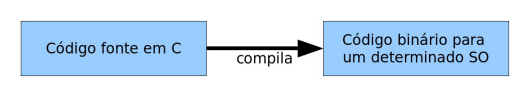
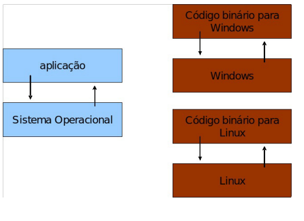
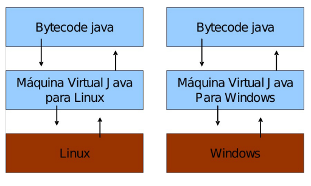
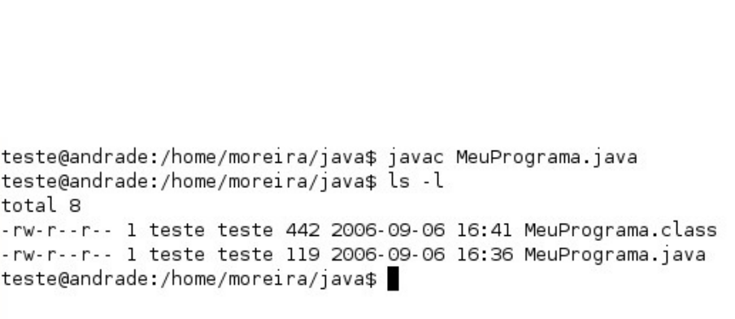
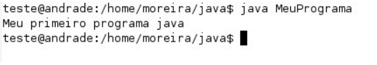

- [O QUE É JAVA](#o-que-é-java)
  - [COMO É O BYTECODE?](#como-é-o-bytecode)
  - [EXERCÍCIOS](#exercícios)
  - [EXERCÍCIOS OPCIONAIS](#exercícios-opcionais)

## O QUE É JAVA

. Apesar disso, a linguagem
teve  seu  lançamento  focado  no  uso  em  clientes  web  (browsers)  para  rodar  pequenas  aplicações
(applets).
O  Java  foi  criado  pela  antiga  Sun  Microsystems  e  mantido  por  meio  de  um  comitê
(http://www.jcp.org). 
. Com a compra da Sun pela
Oracle  em  2009,  muitas  URLs  e  nomes  têm  sido  trocados  para  refletir  a  marca  da  Oracle.  A  página
principal do Java é: http://www.oracle.com/technetwork/java/
Hoje com o anunciamento de parada de uso pela Oracle existe o **open jdk** criada e mantida pela comunidade
Você pode ler a história da linguagem Java em: http://www.java.com/en/javahistory/
E um vídeo interessante: http://tinyurl.com/histjava

Em  uma  linguagem  de  programação  como  C  e  Pascal,  temos  a  seguinte  situação  quando  vamos
compilar um programa:


O  código  fonte  é  compilado  para  código  de  máquina  específico  de  uma  plataforma  e  sistema
operacional. Muitas vezes, o próprio código fonte é desenvolvido visando uma única plataforma!
Esse  código  executável  (binário)  resultante  será  exercido  pelo  sistema  operacional  e,  por  esse
motivo, ele deve saber conversar com o sistema operacional em questão.


Isto é, temos um código executável para cada sistema operacional

Já  o  Java  utiliza  o  conceito  de **máquina  virtual**,  no  qual  existe,  entre  o  sistema  operacional  e  a
aplicação,  uma  camada  extra  responsável  por  traduzir  –  mas  não  apenas  isso  –  o  que  sua  aplicação
deseja fazer para as respectivas chamadas do sistema operacional em que ela está rodando no momento:


Dessa forma, a maneira em que se abre uma janela no Linux ou no Windows é a mesma: você ganha
independência de sistema operacional. Repare que uma máquina virtual é um conceito bem mais amplo que o de um interpretador. Em  outras  palavras,  ela  é  responsável  por  gerenciar  memória,  Threads,  a  pilha  de
execução, etc.
Sua  aplicação  roda  sem  nenhum  envolvimento  com  o  sistema  operacional,  sempre  conversando
apenas com a **Java Virtual Machine (JVM)**.


Essa  característica  é interessante:  como tudo  passa  pela  JVM,  ela  pode tirar  métricas,  decidir  em
qual lugar é melhor alocar a memória, além de isolar totalmente a aplicação do sistema operacional.
Essa camada de isolamento também é interessante quando pensamos em um servidor que não pode
se sujeitar a rodar código que possa interferir na boa execução de outras aplicações.

Essa camada, a máquina virtual, não entende código Java, mas compreende um código de máquina
específico. Esse código de máquina é gerado por um compilador Java, como o ** **javac****, e é conhecido por
**"bytecode"**, pois existem menos de 256 códigos de operação dessa linguagem, e cada opcode gasta um
byte.

**WRITE ONCE, RUN ANYWHERE**
Esse era um slogan que a Sun usava para o Java, já que você não precisa reescrever partes da
sua aplicação toda vez que quiser mudar de sistema operacional.


**Hotspot** é a tecnologia que a JVM utiliza para detectar pontos quentes da sua aplicação: código que é
executado muito provavelmente dentro de um ou mais loops.

Quando a JVM julgar necessário, ela vai
compilar  esses  códigos  para  instruções  realmente  nativas  da  plataforma,  tendo  em  vista  que  isso  irá
provavelmente  melhorar  a  performance  da  sua  aplicação.  Esse  compilador  é  o **JIT : Just in TimeCompiler**, que aparece bem na hora em que precisa.

Você  pode  pensar  então:  por  que  a  JVM  não  compila tudo  antes  de  executar  a  aplicação?  É  que,
teoricamente,  compilar  de  forma  dinâmica,  na  medida  do  necessário,  pode  gerar  uma  performance
melhor.

Já  a  JVM,  por  estar  compilando  dinamicamente  durante  a  execução,  pode  perceber  que  um
determinado código não está com a performance adequada e otimizar mais um pouco aquele trecho ou
ainda mudar a estratégia de otimização


O que gostaríamos de baixar no site da Oracle?
* **JVM**: apenas a **virtual machine**. Esse download não existe, pois ela sempre vem acompanhada.
* **JRE**: Java Runtime Environment. Ambiente de execução Java, formado pela JVM e bibliotecas,
tudo que você precisa para executar uma aplicação Java. Mas precisamos de mais.
* **JDK**: Java  Development  Kit.  Nós,  desenvolvedores,  faremos  o  download  do  JDK  do  Java  SE
(Standard Edition). Ele é formado pela JRE somado às ferramentas como o compilador.

O  foco  da  plataforma  é  outro:  aplicações  de  médio  a  grande  porte,  em  que  o  time  de
desenvolvedores tem várias pessoas e sempre pode vir a mudar e crescer.
Porém,  com  uma  linguagem
orientada a  objetos e madura como  o  Java,  será extremamente mais  fácil e  rápido  fazer alterações  no
sistema desde que você siga as boas práticas e recomendações sobre design orientado a objetos

Outro  ponto  importante:  quando  falamos  de  Java  Virtual  Machine,  estamos  falando  de  uma
especificação. Ela diz como o bytecode deve ser interpretado pela JVM.  Em  outras  palavras,  existem  outras  JVMs
disponíveis, como a JRockit da BEA (também adquirida pela Oracle), a J9 da IBM, entre outras.

Esse é outro ponto interessante para as empresas. Caso não estejam gostando de algum detalhe da
JVM  da  Oracle  ou  prefiram trabalhar  com  outra  empresa  pagando  por  suporte,  elas  podem trocar  de
JVM com a garantia absoluta 

Porém,  quebrar  o  paradigma  procedural  para  mergulhar  na  orientação  a  objetos  não  é  simples;
quebrá-lo e ganhar fluência com a linguagem e API são os objetivos do FJ-11

O começo  pode  ser  um  pouco  frustrante: exemplos  simples, controle  de  fluxo com  o  if ,   for ,
 while  e criação de pequenos programas que nem ao menos captam dados do teclado. Apesar de isso
tudo  ser  necessário,  é  só  nos  20%  finais  do  curso  em  que  utilizaremos  bibliotecas  para,  no  final,
criarmos  um chat entre  duas máquinas  que transferem Strings  por TCP/IP. Nesse ponto, teremos tudo
que é preciso para entender completamente como a API funciona, quem estende quem e o porquê.

COMPILANDO O PRIMEIRO PROGRAMA

Vamos para o nosso primeiro código! O programa que imprime uma linha simples.

Para mostrar uma linha, podemos fazer:

```java
System.out.println("Minha primeira aplicação Java!");
```

Mas esse código não será aceito pelo compilador Java. O Java é uma linguagem bastante burocrática
e precisa de mais do que isso para iniciar uma execução. Veremos os detalhes e os porquês durante os
próximos capítulos. O mínimo que precisaríamos escrever é algo como:


```java
class MeuPrograma {
    public static void main(String[] args) {
                    System.out.println("Minha primeira aplicação Java!");
    }
}
```

Após  digitar  o  código  acima,  grave-o  como  `MeuPrograma.java`  em  algum  diretório.  A  fim  de
compilar, você deve pedir para que o compilador de Java da Oracle, chamado   **javac** , gere o bytecode
correspondente ao seu código Java.


Depois de compilar, o bytecode foi gerado. Quando o sistema operacional listar os arquivos contidos
no diretório atual, você verá que um arquivo `.class` foi gerado com o mesmo nome da sua classe Java.

Os procedimentos para executar seu programa são muito simples. O  **javac** é o compilador Java, e o
Java é o responsável por invocar a máquina virtual para interpretar o seu programa.


Ao executar, pode ser que a acentuação  resultante saia errada devido a algumas configurações que
deixamos de fazer. Sem problemas.

### COMO É O BYTECODE?

É  como  um  assembly  escrito  para  essa  máquina  em  específico. Podemos  ler  os  mnemônicos utilizando a ferramenta javap que acompanha o JDK:

        javap -c MeuPrograma 

E a saída:

```java
MeuPrograma();
  Code:
   0:   aload_0
   1:   invokespecial   #1; //Method java/lang/Object."<init>":()V
   4:   return
public static void main(java.lang.String[]);
    Code:
    0:    getstatic    #2; //Field java/lang/System.out:Ljava/io/PrintStream;
    3:   ldc     #3; //String Minha primeira aplicação Java!!
    5:   invokevirtual   #4; //Method java/io/PrintStream.println:
                                (Ljava/lang/String;)V
    8:   return
}
```
É o código acima que a JVM sabe ler. É o código de máquina da máquina virtual
Um  bytecode  pode  ser  revertido  para  o  .java  original  (com  perda  de  comentários  e  nomes  de
variáveis locais). Caso seu software vire um produto de prateleira, é fundamental usar um **ofuscador** no
seu  código  que  irá  embaralhar  classes,  métodos  e  um  monte  de  outros  recursos  (indicamos  o
http://proguard.sf.net).

### EXERCÍCIOS
1.  Altere seu programa para imprimir uma mensagem diferente.
2.  Altere seu programa para imprimir duas linhas de texto usando duas linhas de código System.out.
3.  Sabendo  que  os  caracteres   `\n`   representam  uma  quebra  de linhas, imprima  duas linhas  de texto
usando uma única linha de código  `System.out` .

### EXERCÍCIOS OPCIONAIS

1.  Um arquivo fonte Java deve sempre ter a extensão  .java  ou o compilador o rejeitará. Além disso,
existem  algumas  outras  regras  na  hora  de  dar  o  nome  a  um  arquivo  Java.  Experimente  gravar  o
código desse capítulo com  OutroNome.java  ou algo similar.
Compile e verifique o nome do arquivo gerado. Como executar a sua aplicação?
