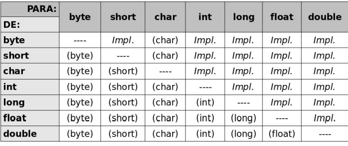
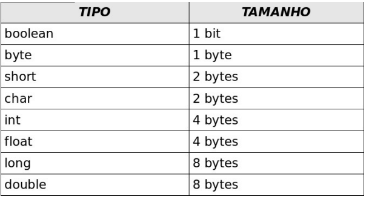
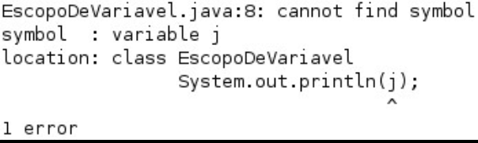

- [VARIÁVEIS PRIMITIVAS E CONTROLE DE FLUXO](#variáveis-primitivas-e-controle-de-fluxo)
  - [DECLARANDO E USANDO VARIÁVEIS](#declarando-e-usando-variáveis)
    - [COMENTÁRIOS EM JAVA](#comentários-em-java)
    - [COMO RODAR ESSES CÓDIGOS?](#como-rodar-esses-códigos)
  - [TIPOS PRIMITIVOS E VALORES](#tipos-primitivos-e-valores)
    - [OUTROS TIPOS PRIMITIVOS](#outros-tipos-primitivos)
  - [EXERCÍCIOS: VARIÁVEIS E TIPOS PRIMITIVOS](#exercícios-variáveis-e-tipos-primitivos)
  - [CASTING E PROMOÇÃO](#casting-e-promoção)
  - [CASOS NÃO TÃO COMUNS DE CASTING E ATRIBUIÇÃO](#casos-não-tão-comuns-de-casting-e-atribuição)
    - [CASTINGS POSSÍVEIS](#castings-possíveis)
    - [TAMANHO DOS TIPOS](#tamanho-dos-tipos)
  - [O IF E O ELSE](#o-if-e-o-else)
    - [PÓS INCREMENTO ++](#pós-incremento-)
  - [CONTROLANDO LOOPS](#controlando-loops)
  - [ESCOPO DAS VARIÁVEIS](#escopo-das-variáveis)


## VARIÁVEIS PRIMITIVAS E CONTROLE DE FLUXO


Aprenderemos a trabalhar com os seguintes recursos da linguagem Java:
* Declaração, atribuição de valores, casting e comparação de variáveis;
* Controle de fluxo por meio de  if  e  else ;
* Instruções de laço for e  while , controle de fluxo com break e continue.

### DECLARANDO E USANDO VARIÁVEIS
Dentro de um bloco, podemos declarar variáveis e usá-las. Em Java, toda variável tem um tipo que
não pode ser mudado uma vez declarado:
        tipoDaVariavel nomeDaVariavel;

Por exemplo, é possível ter uma  idade  que guarda um número inteiro:
`int idade;`

#### COMENTÁRIOS EM JAVA
Com o objetivo de  fazer um comentário em Java, você pode usar o  //   para comentar até  o
final da linha ou, então, utilizar o  /* */  para comentar o que estiver entre eles.
```java
    /* comentário daqui
até aqui */.
// uma linha de comentário sobre a idade.
int idade;
```

Além  de  atribuir,  você  pode  utilizar  esse  valor.  O  código  a  seguir  declara  novamente  a  variável
idade  com valor 15 e o imprime na saída padrão por meio da chamada  `System.out.println`.

```java
// declara a idade.
int idade;
idade = 15;
// imprime a idade.
System.out.println(idade);

```
Você  pode  usar  os  operadores  +,  -, /  e  *  para  operar  com  números,  sendo  eles  responsáveis  pela
adição,  subtração,  divisão  e  multiplicação,  respectivamente.  Além  desses  operadores  básicos,  há  o
operador % (módulo), que é o resto de uma divisão inteira. Veja alguns exemplos:

```java
int quatro = 2 + 2;
int tres = 5 - 2;
int oito = 4 * 2;
int dezesseis = 64 / 4;
int um = 5 % 2; // 5 dividido por 2 dá 2, e tem resto 1; 
// o operador % pega o resto da divisão inteira.
```
#### COMO RODAR ESSES CÓDIGOS?

Você deve colocar esses trechos de código dentro do bloco main que vimos no capítulo anterior.
Isto é, deve ficar no miolo do programa. Use bastante  System.out.println , pois, dessa  forma,
poderá ver algum resultado. Caso contrário, ao executar a aplicação, nada aparecerá

```java
class TestaIdade {
    public static void main(String[] args) {
                    // imprime a idade.
                    int idade = 20;
                    System.out.println(idade);
                    // gera uma idade no ano seguinte.
                    int idadeNoAnoQueVem;
                    idadeNoAnoQueVem = idade + 1;
                    // imprime a idade.
                    System.out.println(idadeNoAnoQueVem);
    }
}
```

### TIPOS PRIMITIVOS E VALORES

Esses tipos de variáveis são tipos primitivos do Java: o valor que elas guardam são o real conteúdo
da variável. Quando você utilizar o operador de atribuição  = , o valor será copiado.

```java
int i = 5; // i recebe uma cópia do valor 5;
int j = i; // j recebe uma cópia do valor de i;
i = i + 1; // i vira 6, j continua 5.
```

Aqui, o  i  fica com o valor de 6. Mas, e  j ? Na segunda linha,  j  está valendo 5. Quando  i  passa
a valer 6, será que  j  também muda de valor? Não, pois o valor de um tipo primitivo sempre é copiado.
Apesar de a linha 2 fazer  j = i , a partir desse momento, essas variáveis não têm relação nenhuma:
o que acontece com uma não reflete em nada na outra.

#### OUTROS TIPOS PRIMITIVOS
Vimos  aqui  os  tipos  primitivos  que  mais  aparecem.  O  Java  tem  outros,  que  são  o   byte ,
 short ,  long  e  float .
Cada tipo tem características especiais que, para um programador avançado, podem fazer muita
diferença.

### EXERCÍCIOS: VARIÁVEIS E TIPOS PRIMITIVOS

1.  Na  empresa  em  que trabalhamos,  há tabelas  com  o  gasto  de  cada  mês.  Para  fechar  o  balanço  do
primeiro trimestre,  precisamos  somar  o  gasto total. Sabendo  que, em janeiro,  foram  gastos  15 mil
reais, em fevereiro, 23 mil reais e, em março, 17 mil reais, faça um programa que calcule e imprima
a despesa total no trimestre e a média mensal de gastos.
Se você estiver fazendo em casa e precisar de ajuda, consulte o capítulo Resoluções de Exercícios

### CASTING E PROMOÇÃO

Alguns valores são incompatíveis se você tentar fazer uma atribuição direta. Enquanto um número
real costuma ser representado em uma variável do tipo  double , tentar atribui-lo a uma variável  int 
não  funciona, porque é um código que diz: "i deve valer d", mas não se sabe se  d   realmente  é  um
número inteiro ou não.
```java
double d = 3.1415;
int i = d; // não compila.
```
A mesma coisa ocorre no seguinte trecho:
```java
int i = 3.14;
```

Às  vezes,  precisamos  que  um  número  quebrado  seja  arredondado  e  armazenado  em  um  número
inteiro. Para  fazer isso  sem  que  haja  o erro  de compilação, é  preciso  ordenar  que  o  número  quebrado
seja moldado (casted) como um número inteiro. Esse processo recebe o nome de casting.
```java
double d3 = 3.14;
int i = (int) d3;
```

### CASOS NÃO TÃO COMUNS DE CASTING E ATRIBUIÇÃO
Alguns castings aparecem também:

```java
float x = 0.0;
```
O  código  acima  não  compila,  pois  todos  os  literais  com  ponto  flutuante  são  considerados **double**  pelo Java. E  **float**   não  pode  receber  um  double   sem  a  perda  de informação.  Para
fazê-lo funcionar, podemos escrever:
```java
float x = 0.0f;
```
A letra `f`, que pode ser maiúscula ou minúscula, indica que aquele literal deve ser tratado como
 float .
Outro caso que é mais comum:
```java
double d = 5;
float f = 3;
float x = f + (float) d;
```
Você precisa do **casting** porque o Java  faz as contas e vai armazenando sempre no maior tipo que apareceu durante as operações, neste caso, o  double .
E uma observação: no mínimo, o Java armazena o resultado em um  `int`  na hora de fazer as contas.
Até casting com variáveis do tipo  char  podem ocorrer. O único tipo primitivo que não pode
ser atribuído a nenhum outro tipo é o  `boolean` .

#### CASTINGS POSSÍVEIS



#### TAMANHO DOS TIPOS
Na tabela abaixo, estão os tamanhos de cada tipo primitivo do Java.



###  O IF E O ELSE
No Java, a sintaxe do  `if`  é a seguinte:
```java
if (condicaoBooleana) {
    codigo;
}
```

Uma condição booleana é qualquer expressão que retorne  true  ou  false . Para isso, você pode
usar os operadores  < ,  > ,  <= ,  >=  e outros. Um exemplo:
```java
int idade = 15;
if (idade < 18) {
    System.out.println("Não pode entrar");
}

```

Você pode concatenar expressões booleanas por meio dos operadores lógicos **"E"** e **"OU"**. O **"E"** é
representado pelo  **&&** , e o **"OU"** é representado pelo  **||** . operador  de  negação,  o   **!** .

```java
int idade = 15;
boolean amigoDoDono = true;
if (idade < 18 && !amigoDoDono) {
    System.out.println("Não pode entrar");
}
else {
    System.out.println("Pode entrar");
}
```
#### PÓS INCREMENTO ++
`i = i + 1`  pode realmente ser substituído por  `i++`  quando isolado. Porém, em alguns casos,
temos essa instrução envolvida em, por exemplo, uma atribuição:
```java
int i = 5;
int x = i++;
```
Qual é o valor de  `x` ? O de  `i` , após essa linha, é 6.
O  operador   `++` ,  quando  vem  após  a  variável,  retorna  o  valor  antigo  e  o  incrementa  (pósincremento), fazendo  x  valer 5.
Se você tivesse usado o  `++`  antes da variável (pré-incremento), o resultado seria 6:
```java
int i = 5;
int x = ++i; // aqui x valera 6.
```

### CONTROLANDO LOOPS

Para parar o loop a palavra-chave  `break` .
Obrigar  o  loop  a  executar  o  próximo  laço.  Para  isso,  usamos  a palavra-chave  `continue` .

### ESCOPO DAS VARIÁVEIS

```JAVA
// aqui, a variável i não existe.
int i = 5;
// a partir daqui, ela existe.
```

O escopo da variável é o nome dado ao trecho de código em que aquela variável existe e o lugar onde é possível acessá-la

Quando abrimos um novo bloco com as chaves, as variáveis declaradas ali dentro só valem até o fim daquele bloco.

```java
// aqui, a variável i não existe.
int i = 5;
// a partir daqui, ela existe.
while (condicao) {
// o i ainda vale aqui.
int j = 7;
// o j passa a existir.
}
// aqui, o j não existe mais, porém o i continua dentro do escopo
```

No bloco acima, a variável  j  para de existir quando termina o bloco no qual ela foi declarada. Se
você tentar acessar uma variável fora do escopo dela, ocorrerá um erro de compilação



Uma situação parecida pode ocorrer com o  `for` :
```java
for (int i = 0; i < 10; i++) {
    System.out.println("olá!");
}
System.out.println(i); // cuidado!
```
Nesse  `for` ,  a  variável `i`  morre  ao  seu  término,  não  podendo  ser  acessada  de  fora  do   `for` e gerando um  erro de  compilação. Se você realmente quer  acessar o  contador depois do loop terminar, precisa de algo como:

