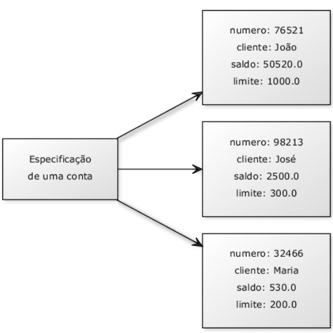
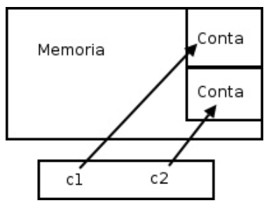
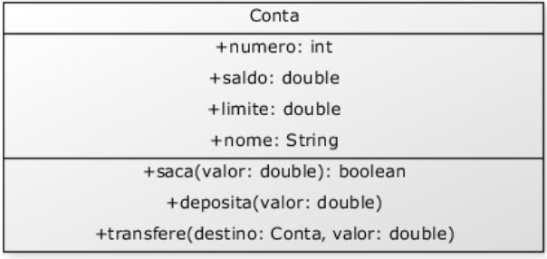
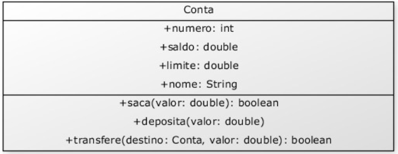
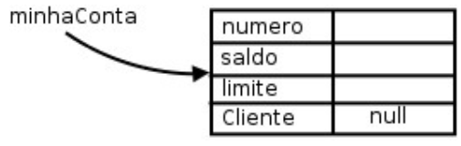

- [ORIENTAÇÃO A OBJETOS BÁSICA](#orientação-a-objetos-básica)
  - [4.1 MOTIVAÇÃO: PROBLEMAS DO PARADIGMA PROCEDURAL](#41-motivação-problemas-do-paradigma-procedural)
  - [4.2 CRIANDO UM TIPO](#42-criando-um-tipo)
  - [4.3 UMA CLASSE EM JAVA](#43-uma-classe-em-java)
  - [4.4 CRIANDO E USANDO UM OBJETO](#44-criando-e-usando-um-objeto)
  - [4.5 MÉTODOS](#45-métodos)
  - [4.6 MÉTODOS COM RETORNO](#46-métodos-com-retorno)
  - [4.7 OBJETOS SÃO ACESSADOS POR REFERÊNCIAS](#47-objetos-são-acessados-por-referências)
  - [4.8 O MÉTODO TRANSFERE()](#48-o-método-transfere)
  - [4.9 CONTINUANDO COM ATRIBUTOS](#49-continuando-com-atributos)

## ORIENTAÇÃO A OBJETOS BÁSICA

### 4.1 MOTIVAÇÃO: PROBLEMAS DO PARADIGMA PROCEDURAL
Orientação a objetos é uma maneira de programar que ajuda na organização e resolve muitos problemas enfrentados pela programação procedural.

Consideremos o clássico problema da validação de um CPF. Normalmente, temos um formulário no
qual recebemos essa informação e depois temos de enviar esses caracteres a uma função que vai validá-
lo, como no pseudocódigo abaixo:

```
cpf = formulario->campo_cpf
valida(cpf)
```

Alguém o obriga a sempre validar esse CPF? Você pode, inúmeras vezes, esquecer de chamar esse
validador. Mas: considere que você tem 50 formulários e precise validar em todos o CPF. Se sua equipe
tem três programadores trabalhando nesses formulários, quem fica responsável por essa validação?
Todos!
A situação pode piorar: na entrada de um novo desenvolvedor, precisaríamos avisá-lo de que sempre
devemos validar o CPF de um formulário. 

Outra situação na qual ficam claros os problemas da programação procedural é quando nos
encontramos na necessidade de ler o código que foi escrito por outro desenvolvedor e descobrir como
ele funciona internamente.

O  problema  do  **paradigma  procedural**  é que não  existe  uma forma simples  de  criar  conexão forte
entre  dados  e funcionalidades. No  **paradigma  orientado  a  objetos**,  é muito fácil ter  essa  conexão  por
meio dos recursos da própria linguagem

### 4.2 CRIANDO UM TIPO
Considere  um  programa  para  um  banco.  É  bem  fácil  perceber  que  uma  entidade  extremamente
importante ao nosso sistema é a conta. Nossa ideia aqui é generalizarmos alguma informação juntamente
com as funcionalidades que toda conta deve ter.
O que toda conta tem que é importante para nós?

* Número da conta;
* Nome do titular da conta;
* Saldo.

O que toda conta faz que é importante para nós? Isto é, o que gostaríamos de "pedir à conta"?
* Saca uma quantidade x;
* Deposita uma quantidade x;
* Imprime o nome do titular da conta;
* Devolve o saldo atual;
* Transfere uma quantidade x para uma outra conta y;
* Devolve o tipo de conta


Com isso, temos o projeto de uma conta bancária. Podemos pegar esse projeto e acessar seu saldo?
Não. O que temos ainda é o projeto. Antes, precisamos construir uma conta para poder acessar o que
ela tem e pedir a ela que faça algo.



Ao projeto da conta, isto é, à definição da conta, damos o nome de classe. Ao que podemos construir
a partir desse projeto; às contas de verdade, damos o nome de objetos

A  palavra  classe  vem  da  taxonomia  da  biologia.  Todos  os  seres  vivos  de  uma  mesma  classe
biológica têm uma série de atributos e comportamentos em comum, mas não são iguais, pois podem
variar nos valores desses atributos e como realizam esses comportamentos.

Um outro exemplo: uma receita de bolo. A pergunta é certeira: você come uma receita de bolo? Não.
Precisamos instanciá-la e fazer um objeto bolo  a partir dessa  especificação (a  classe) para utilizá-la.
Podemos  criar  centenas  de  bolos  com  base  nessa  classe  (a  receita,  no  caso).
Eles  podem  ser  bem
semelhantes, alguns até idênticos, mas são objetos diferentes
### 4.3 UMA CLASSE EM JAVA

Começaremos apenas com o que uma  Conta  tem, e não com o que ela faz (veremos isso logo em
seguida).
```java
class Conta {
    int numero;
    String titular;
    double saldo;
    // ..
    }
```

### 4.4 CRIANDO E USANDO UM OBJETO
Já temos uma classe em Java que especifica o que todo objeto dessa classe deve ter. Mas como usá-la? Além dessa classe, ainda teremos o Programa.java e, a partir dele, utilizaremos a classe  Conta.

Para criar (construir, instanciar) uma  Conta , basta usar  a palavra-chave  new . Devemos  utilizar
também os parênteses, que descobriremos o que fazem exatamente no próximo capítulo. Mas como acessar esse objeto que foi criado?
Precisamos ter alguma forma de nos referenciarmos a esse objeto. Precisamos de uma variável:

```java
class Programa {
public static void main(String[] args) {
            Conta minhaConta;
            minhaConta = new Conta();
        }

```

Por  meio  da  variável   minhaConta ,  podemos  acessar  o  objeto  recém  criado  para  alterar  seu
 titular , seu  saldo , etc.:
```java
class Programa {
public static void main(String[] args) {
        Conta minhaConta;
        minhaConta = new Conta();
        minhaConta.titular = "Duke";
        minhaConta.saldo = 1000.0;
        System.out.println("Saldo atual: " + minhaConta.saldo);
    }
}

```

### 4.5 MÉTODOS

Dentro  da  classe,  também  declararemos  o  que  cada  conta  faz  e  como  isso  é  feito  -  os comportamentos  que  cada  classe  tem, que essas funções são chamadas de métodos, pois é a maneira de fazer uma operação com um objeto.

Queremos  criar  um  método  que  saca  uma  determinada  quantidade  e  não  devolve  nenhuma informação para quem acionar esse método:
```java
public class Conta {
    int numero;
    String nome;
    double saldo;
    void saca(double qtd) {
        double novoSaldo = this.saldo - qtd;
        this.saldo = novoSaldo;
    }
    
}

```
A  palavra-chave   void   diz  que  quando  você  pedir  para  a  conta  sacar  uma  quantia,  nenhuma
informação será enviada de volta a quem pediu.

Quando alguém pedir para sacar, ela também dirá quanto quer sacar. Por isso, precisamos declarar o
método com algo dentro dos parênteses - o que vai aí dentro é chamado de argumento do método (ou
parâmetro). 
No momento  em  que  vamos  acessar  nosso atributo, usamos a palavra-chave  this  para mostrar que esse é um atributo, e não uma simples variável (veremos depois que é opcional).


Repare  que,  nesse  caso,  a  conta  poderia  estourar  um  limite  fixado  pelo  banco.  Mais  para  frente,
evitaremos essa situação de uma maneira muito elegante.
Da mesma forma, temos o método para depositar alguma quantia:
```java
class Conta {
// ... outros atributos e métodos ...
void deposita(double quantidade) {
this.saldo += quantidade;
    }
}
```
O  `+=`  soma quantidade ao valor antigo do saldo e guarda o valor resultante no
próprio saldo.

Para mandar uma mensagem ao objeto e pedir que ele execute um método, também usamos o ponto. O termo usado para isso é **invocação de método**

```java
class TestaAlgunsMetodos {
public static void main(String[] args) {
// criando a conta
        Conta minhaConta;
        minhaConta = new Conta();
// alterando os valores de minhaConta
        minhaConta.titular = "Duke";
        minhaConta.saldo = 1000;
// saca 200 reais
        minhaConta.saca(200);
// deposita 500 reais
        minhaConta.deposita(500);
        System.out.println(minhaConta.saldo);
    }
}
```

### 4.6 MÉTODOS COM RETORNO

Um método pode retornar um valor para o código que o chamou. No caso do nosso método  saca ,
podemos devolver um valor booleano indicando que a operação foi bem-sucedida

```java
class Conta {
// ... outros métodos e atributos...
boolean saca(double valor) {
    if (this.saldo < valor) {
        return false;
        }
    else {
        this.saldo = this.saldo - valor;
        return true;
        }
    }
}
```

A  palavra-chave
 return  indica que o método terminará ali, retornando tal informação.
Exemplo de uso:
```java
minhaConta.saldo = 1000;
if (minhaConta.saca(2000)) {
        System.out.println("Consegui sacar");
    } else {
        System.out.println("Não consegui sacar");
    }
```


### 4.7 OBJETOS SÃO ACESSADOS POR REFERÊNCIAS
Quando declaramos uma variável para associar a um objeto, na verdade, essa variável não guarda o objeto, mas, sim, uma maneira de acessá-lo, chamada de **referência**.

É por esse motivo que, diferente dos tipos primitivos como  int   e  long ,  precisamos  dar  new 
depois de declarada a variável:
```java
public static void main(String[] args) {
        Conta c1;
        c1 = new Conta();
        Conta c2;
        c2 = new Conta();
    }
```

Depois de um tempo, os programadores Java falarem: "tenho
um objeto c do tipo Conta" como um modo para encurtar a frase: "tenho uma referência c a um objeto
do tipo Conta".

Basta lembrar que, em Java, uma variável nunca é um objeto. Não há, no Java, uma maneira de
criarmos o que é conhecido como objeto pilha ou objeto local, pois todo objeto, nessa linguagem, sem
exceção, é acessado por uma variável referência.
Esse código nos deixa na seguinte situação:
```java
Conta c1;
    c1 = new Conta();
    Conta c2;
    c2 = new Conta();
```



Para  quem  conhece,  é  parecido  com  um  ponteiro.  Porém,  você  não  pode  manipulá-lo  como  um número nem utilizá-lo para aritmética, pois ela é tipada.

Um outro exemplo:
```java
class TestaReferencias {
public static void main(String[] args) {
            Conta c1 = new Conta();
            c1.deposita(100);
            Conta c2 = c1;  // linha importante!
            c2.deposita(200);
            System.out.println(c1.saldo);
             System.out.println(c2.saldo);
        }
    }
```
O que acontece aqui? O operador  =  copia o valor de uma variável. Mas qual é o valor da variável
 c1 ? É o objeto? Não. Na verdade, o valor guardado é a referência (endereço) ao local onde o objeto se
encontra na memória principal.

Podemos, então, ver outra situação:
```java
public static void main(String[] args) {
        Conta c1 = new Conta();
        c1.titular = "Duke";
        c1.saldo = 227;
        Conta c2 = new Conta();
        c2.titular = "Duke";
        c2.saldo = 227;
if (c1 == c2) {
            System.out.println("Contas iguais");
        }
    }

```

Como em cada uma dessas variáveis guardamos duas contas criadas
diferentemente, elas estão em espaços distintos da memória, o que faz o teste  `if`   valer  `false`

Quando se trata de objetos, pode ficar mais fácil pensar que o  ==  compara se os objetos (referências, na verdade) são o mesmo, e não se são iguais.


Para  saber  se  dois  objetos  têm  o  mesmo  conteúdo,  você  precisa  comparar  atributo  por  atributo.Veremos uma solução mais elegante para isso também.


### 4.8 O MÉTODO TRANSFERE()


A ideia é que, quando chamarmos o método  transfere , já teremos um objeto do tipo  Conta  (o this ). Portanto, o método recebe apenas um parâmetro do tipo  Conta , isto é, a Conta destino (além
do  valor ):

```java
class Conta {
// atributos e métodos...
void transfere(Conta destino, double valor) {
this.saldo = this.saldo - valor;
            destino.saldo = destino.saldo + valor;
        }
    }
```



Para deixar o código mais robusto, poderíamos verificar se a conta tem a quantidade a ser transferida
disponível. Com o intuito de ficar ainda mais interessante, você pode chamar os métodos  deposita  e
 saca  já existentes para fazer essa tarefa:

```java
class Conta {
// atributos e métodos...
boolean transfere(Conta destino, double valor) {
boolean retirou = this.saca(valor);
        if (retirou == false) {
        // não deu pra sacar!
            return false;
            }
        else {
            destino.deposita(valor);
            return true;
            }
        }
    }
```



Quando passamos uma  Conta  como argumento, o que será que acontece na memória? Será que o
objeto é clonado?
No Java, a passagem de parâmetro funciona como uma simples atribuição tal qual no uso do "=".
Então, esse parâmetro copiará o valor da variável do tipo  Conta  que for passado como argumento. E
qual  é  o  valor  de  uma  variável  dessas?  Seu  valor  é  um  endereço  ou  uma  referência mas  nunca  um objeto. Por isso, não há cópia de objetos aqui.

objeto. Por isso, não há cópia de objetos aqui.


### 4.9 CONTINUANDO COM ATRIBUTOS

As  variáveis  do  tipo  atributo,  diferentemente  das  variáveis  temporárias  (declaradas  dentro  de  um
método),  recebem  um  valor  padrão.  No  caso  numérico,  valem   `0` e  ,  no  caso  de   `boolean` ,  valem `false` 

Você também pode dar valores default, como segue:
```java
class Conta {
int numero = 1234;
        String titular = "Duke";
double saldo = 1000.0;
    }
```


Nesse caso, quando você criar uma conta, seus atributos já estarão "populados" com esses valores
colocados.
Seus atributos também podem ser referências às outras classes. Suponha a seguinte classe  Cliente :
```java
class Cliente {
    String nome;
    String sobrenome;
    String cpf;
    }
class Conta {
    int numero;
    double saldo;
    Cliente titular;
    // ..
    }
//E dentro do  main  da classe de teste:
class Teste {
public static void main(String[] args) {
            Conta minhaConta = new Conta();
            Cliente c = new Cliente();
            minhaConta.titular = c;
// ...
        }
    }
```

Um	 sistema	 orientado	 a	 objetos	 é	 um	 grande	 conjunto	 de	 classes	 que	 se	 comunicará	 delegando
responsabilidades	 a	 quem	for	mais	 apto	 a	realizar	 determinada	 tarefa.	A	 classe		Banco		 usa	 a	 classe
	Conta	;	 esta	 usa	 a	 classe		Cliente		 que,	 por	sua	 vez,	 usa	 a	 classe		Endereco	.	Dizemos	 que	 esses
objetos	colaboram,	trocando	mensagens	entre	si.	Por	isso,	temos	muitas	classes	em	nosso	sistema,	e	elas
costumam	ter	um	tamanho	relativamente	curto


Mas	e	se	dentro	do	meu	código	eu	não	desse		new		em		Cliente		e	tentasse	acessá-lo	diretamente?
```java
class Teste	{
public	static	void	main(String[]	args) {
												Conta	minhaConta	=	new	Conta();
												minhaConta.titular.nome	=	"Manoel";
//	...
								}
				}

```

Quando	 damos	 	new		 em	 um	 objeto,	 ele	 o	 inicializa	 com	 seus	 valores	 default:	 0	 para	 números,
	false		para		boolean		e		null		para	referências.		null		é	uma	palavra-chave	em	Java	que	indica	uma
referência	a	nenhum	objeto



