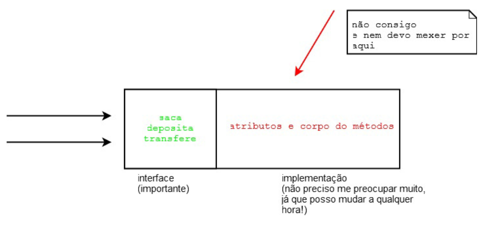

## MODIFICADORES DE ACESSO E ATRIBUTOS DE CLASSE

### 5.1 CONTROLANDO O ACESSO

Um dos problemas mais simples que temos no nosso sistema de contas é que o método saca
permite sacar independentemente de o saldo ser insuficiente. A seguir, você pode lembrar como está a
classe Conta :

```java
class Conta	{
		String	titular;
		int	numero;
		double	saldo;
		//	..
		void	saca(double	valor) {
		this.saldo	=	this.saldo	-	valor;
		}
}

```

A classe a seguir mostra como é possível ultrapassar o limite de saque usando o método saca :
```java
class TestaContaEstouro1 {

	public	static	void	main(String[]	args) {
			Conta	minhaConta	=	new	Conta();
			minhaConta.saldo	=	1000.0;
			minhaConta.saca(50000);	//	saldo	é	só	1000!!
		}
}
```

Para fazer isso no Java, basta declarar que os atributos não podem ser acessados de fora da classe por
meio da palavra-chave private :

```java
class Conta	{
private double	saldo;
//	...
}
```

O `private` é um **modificador de acesso** (também chamado de modificador de visibilidade).
Marcando um atributo como privado, fechamos o seu acesso em relação a todas as outras classes e
fazemos com que o seguinte código não compile:

```java
class TestaAcessoDireto	{
public	static	void	main(String[]	args) {
		Conta	minhaConta	=	new	Conta();
	//Não	compila!	Você	não	pode	acessar	o	atributo	privado	de	outra	classe.
		minhaConta.saldo	=	1000;
			}
}
```

        TesteAcessoDireto.java:5	saldo	has	private	access	in	Conta
        minhaConta.saldo	=	1000;
                ^
        1	error

A palavra-chave `private` também pode ser usada a fim de **modificar o acesso a um método**. Tal 
funcionalidade é utilizada em diversos cenários, os mais comuns são: quando existe um método que
serve apenas para auxiliar a própria classe e quando há código repetido dentro de dois métodos da
classe.

Da	mesma	maneira	 que	temos	 o		`private`	,	temos	 o	modificador		public	,	 que	 permite	 a	 todos acessarem	um	determinado	atributo	ou	método	:

```java
class Conta	{
//...
	public	void	saca(double	valor) {
	//posso	sacar	até	saldo
	if	(valor	>	this.saldo){	
		System.out.println("Não	posso	sacar	um	valor	maior	do	que	o	saldo!");
	}else	{
	this.saldo	=	this.saldo	-	valor;
		}
	}
}
```

### 5.2	ENCAPSULAMENTO

O	que	começamos	a	ver	nesse	capítulo	é	a	ideia	de	**encapsular**,	
isto	é,	ocultar	todos	os	membros	de uma	classe	(como	vimos	acima),	
além	de	esconder	como	funcionam	as	rotinas	(no	caso,	métodos)	do
nosso	sistema.



O	conjunto	de	métodos	públicos	de	uma	classe	é	também	chamado	de	**interface	da	classe**,	pois	essa
é	a	única	maneira	pela	qual	você	se	comunica	com	objetos	dessa	classe.


##### PROGRAMANDO VOLTADO À INTERFACE,	E NÃO À IMPLEMENTAÇÃO

É	sempre	bom	programar	pensando	na	interface	da	sua	classe,	em	como	seus	usuários	estarão
utilizando-a,	e	não	somente	em	como	ela	funcionará.
A	 implementação	 em	 si,	 o	 conteúdo	 dos	métodos,	 não	 tem	 tanta	 importância	 para	 o	 usuário
dessa	 classe,	 pois	 ele	só	 precisa	saber	 o	 que	 cada	método	 pretende	fazer,	 e	 não	 como	 ele	 o	faz,
porque	isso	pode	mudar	com	o	tempo

Sempre	 que	 acessamos	 um	 objeto,	 utilizamos	 sua	 interface.	 Existem	 diversas	 analogias	fáceis	 no
mundo	real:
* Quando	você	dirige	um	carro,	o	que	lhe	importa	são	os	pedais	e	o	volante	(interface),	e	não	o	motor
o	 qual	 você	 está	 usando	 (implementação).	 É	 claro:	 um	 motor	 diferente	 pode	 lhe	 dar	 melhores
resultados,	mas	o	que	ele	faz	é	o	mesmo	que	um	motor	menos	potente,	a	diferença	está	em	como
ele	faz.	 Para	 trocar	 um	 carro	 a	 álcool	 por	 um	 a	 gasolina,	 você	 não	 precisa	 reaprender	 a	 dirigir
(trocar	 a	implementação	 dos	métodos	 não	 precisa	mudar	 a	interface,	fazendo	 com	que	 as	 outras
classes	continuem	usando-os	da	mesma	maneira).

Já	temos	conhecimentos	suficientes	para	resolver	aquele	problema	da	validação	de	CPF:

```java
class Cliente	{
private	String	nome;
private	String	endereco;
private	String	cpf;
private int	idade;
public	void	mudaCPF(String	cpf) {
		validaCPF(cpf);
		this.cpf	=	cpf;
				}
		private	void	validaCPF(String	cpf) {
		//	série	de	regras	aqui	falha	caso	não	seja	válida.
				}
//	..
}
```

Se	 alguém	tentar	 criar	um		Cliente		 e	 não	 usar	 o		mudaCPF		 para	 alterar	um		CPF		 diretamente,
receberá	um	erro	de	compilação,	já	que	o	atributo		CPF		é	privado.	E	quando	você	não	precisar	verificar
o	CPF	de	quem	tem	mais	de	60	anos?	Seu	método	fica	o	seguinte:

### 5.3	GETTERS	E	SETTERS

A	fim	de	permitir	o	acesso	aos	atributos	(já	que	eles	são		private	)	de	uma	maneira	controlada,	a
prática	mais	comum	é	criar	dois	métodos,	um	que	retorna	o	valor,	e	outro	o	qual	muda	o	valor.
A	convenção	para	esses	métodos	é	de	colocar	a	palavra		`get`		ou		`set`		antes	do	nome	do	atributo.

```java
class Conta	{
private	String	titular;
private double	saldo;
	public	double	getSaldo() {
		return this.saldo;
			}
	public	void	setSaldo(double	saldo) {
		this.saldo	=	saldo;
			}
	public	String	getTitular() {
		return this.titular;
			}
	public	void	setTitular(String	titular) {
		this.titular	=	titular;
			}
}
```


É	 uma	 má	 prática	 criar	 uma	 classe	 e,	 logo	 em	 seguida,	 fazer	 getters	 e	 setters	 para	 todos	 seus
atributos.	Você	só	deve	criar	um	getter	ou	setter	se	tiver	a	real	necessidade.	Repare	que,	nesse	exemplo,
	setSaldo		não	deveria	ter	sido	criado,	pois	queremos	que	todos	usem		deposita()		e		saca()

### 5.4	CONSTRUTORES

Sempre	quando	o		`new`		 é
chamado,	 ele	 executa	 o	**construtor	 da	 classe**.	 O	 construtor	 da	 classe	 é	 um	 bloco	 declarado	 com	 o
mesmo	nome	que	a	classe:

```java
class Conta	{
	String	titular;
	int	numero;
	double	saldo;
//	construtor
	Conta()	{
		System.out.println("Construindo	uma	conta.");
	}
//	..
}
```

Então,	quando	fizermos:

```java
Conta	c	=	new	Conta();

```
A	mensagem	"construindo	uma	conta"	aparecerá.

### 5.5	A	NECESSIDADE	DE	UM	CONSTRUTOR

Tudo	estava	funcionando	até	agora.	Para	que	utilizamos	um	construtor?
A	ideia	é	bem	simples.	Se	toda	conta	precisa	de	um	titular,	como	obrigar	todos	os	objetos	que	forem
criados	a	ter	um	valor	desse	tipo?	É	só	criar	um	único	construtor	que	receba	essa	String!

Durante	a	construção	de	um	objeto,	você
pode	fazer	com	que	um	construtor	chame	outro	para	não	ter	de	ficar	copiando	e	colando:
```java
class Conta	{
	String	titular;
	int	numero;
	double	saldo;
	//	construtor
	Conta	(String	titular)	{
	// faz	mais	uma	série	de	inicializações	e	configurações
		this.titular	=	titular;
	}
	Conta	(int	numero,	String	titular)	{
		this(titular);	//	chama	o	construtor	que	foi	declarado	acima
		this.numero	=	numero;
	}
//..
}
```

### 5.6	ATRIBUTOS	DE	CLASSE
Nosso	banco	também	quer	controlar	a	quantidade	de	contas	existentes	no	sistema.	Como	poderíamos
fazer	isso?	A	ideia	mais	simples	é:

```java
Conta	c	=	new	Conta();
totalDeContas	=	totalDeContas	+	1;
```

Seria	interessante,	 então,	que	 essa	 variável	fosse	única,	 compartilhada	 por	todos	 os	objetos	dessa
classe.	À	vista	disso,	quando	mudasse	por	meio	de	um	objeto,	o	outro	enxergaria	o	mesmo	valor.	Para
fazer	isso	em	Java,	declaramos	a	variável	como		`static`	.
```java
private static int	totalDeContas;
```

Quando	declaramos	um	atributo	como		static	,	ele	passa	a	não	ser	mais	um	atributo	de	cada	objeto,
e	sim	um	atributo	da	classe.	A	informação	fica	guardada	pela	classe	e	não	é	mais	individual	para	cada
objeto

Para	 acessarmos	 um	 atributo	 estático,	 não	 usamos	 a	 palavra-chave	 	this	,	mas,	 sim,	 o	 nome	 da
classe:

```java
class Conta	{
	private static int	totalDeContas;
//...
	Conta()	{
		Conta.totalDeContas	=	Conta.totalDeContas	+	1;
	}
}
```

Já	 que	 o	 atributo	 é	 privado,	 como	 podemos	 acessar	 essa	 informação	 a	 partir	 de	 outra	 classe?
Precisamos	de	um	getter	para	ele!
```java
class Conta	{
private static int	totalDeContas;
//...
	Conta()	{
		Conta.totalDeContas	=	Conta.totalDeContas	+	1;
	}
	public	int	getTotalDeContas() {
		return	Conta.totalDeContas;
	}
}
```

Como	fazemos,	então,	para	saber	quantas	contas	foram	criadas?
```java
Conta	c	=	new	Conta();
int	total	=	c.getTotalDeContas();
```

Precisamos	criar	uma	conta	antes	de	chamar	o	método.	Isso	não	é	legal,	pois	gostaríamos	de	saber
quantas	contas	existem	sem	precisar	ter	acesso	a	um	objeto-conta.	A	ideia	aqui	é	a	mesma,	transformar
esse	método	que	todo	objeto-conta	tem	em	um	método	de	toda	a	classe.	Usamos	a	palavra		static		de
novo,	mudando	o	método	anterior.

```java
public	static	int	getTotalDeContas() {
return	Conta.totalDeContas;
}
```
Para	acessar	esse	novo	método:

```java
int	total	=	Conta.getTotalDeContas();
```