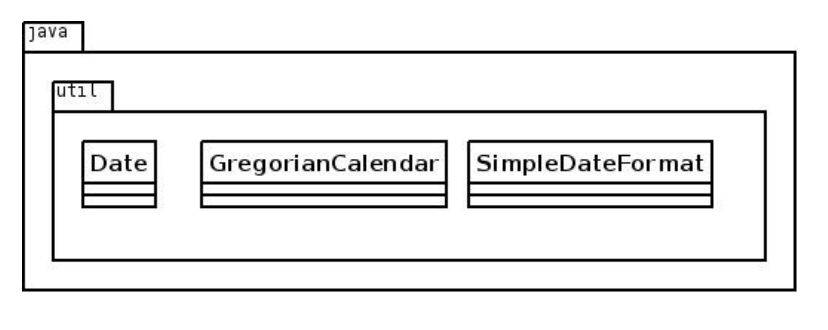
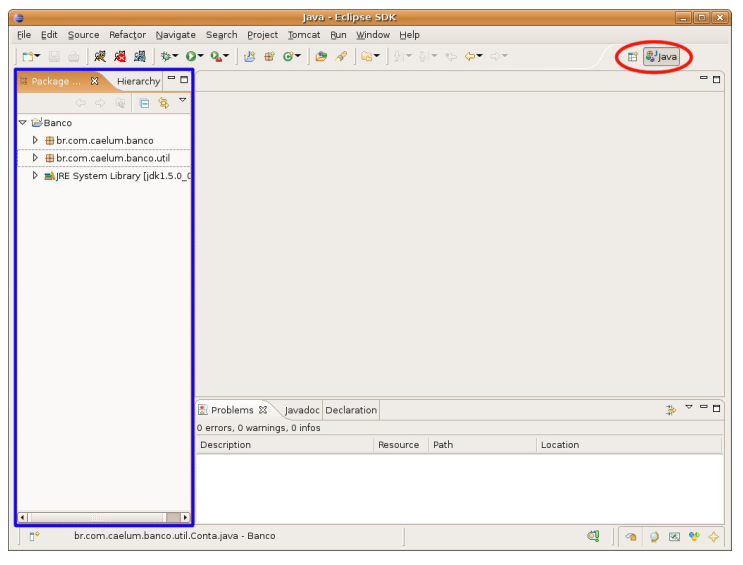
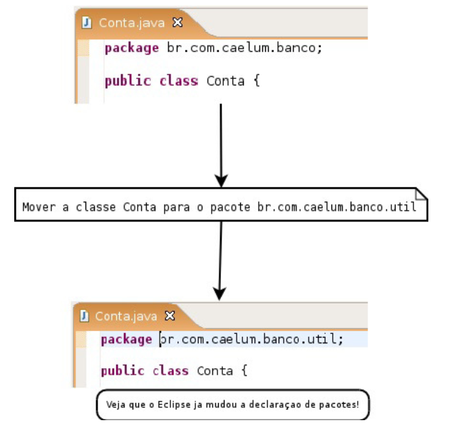

## PACOTES - ORGANIZANDO SUAS CLASSES E BIBLIOTECAS

### 7.1 ORGANIZAÇÃO
Os diretórios estão diretamente relacionados aos chamados **pacotes** e costumam agrupar classes de
funcionalidades similares ou relacionadas.

Por  exemplo,  no  pacote    **java.util**  ,  temos  as  classes    **Date**  ,    **SimpleDateFormat**    e
 **GregorianCalendar** ; todas elas trabalham com datas de formas diferentes


### 7.2 DIRETÓRIOS
Se a classe  **Cliente**  está no pacote  contas , ela deverá estar no diretório com o mesmo nome: **contas** .  Se  ela  se  localiza  no  pacote   **br.com.caelum.contas** ,  significa  que  está  no  diretório  **br/com/caelum/contas** 

A classe  Cliente  que se localiza nesse último diretório mencionado deve ser escrita da seguinte
forma:
```java
package br.com.caelum.contas;
class Cliente {
// ...
    }
```
Fica fácil notar que a palavra-chave  **package**  indica qual o pacote/diretório contém essa classe.
Um pacote pode conter nenhum, ou mais subpacotes e/ou classes dentro dele

O **padrão da Sun** para dar nome aos pacotes é relativo ao nome da empresa que desenvolveu a
classe:
```java
package br.com.nomedaempresa.nomedoprojeto.subpacote
package br.com.nomedaempresa.nomedoprojeto.subpacote2
package br.com.nomedaempresa.nomedoprojeto.subpacote2.subpacote3
```

Os pacotes só têm letras minúsculas, não importa quantas palavras estejam contidas neles. Esse
padrão existe para evitar ao máximo o conflito de pacotes de empresas diferentes.

### 7.3 IMPORT

Se quisermos que a classe  **Banco**  fique dentro do
pacote  *br.com.caelum.contas* , ela deve ser declarada assim:
```java
package br.com.caelum.contas;
class Banco {
        String nome;
    }
```
Para a classe  **Cliente**  ficar no mesmo pacote, seguimos a mesma fórmula:
```java
package br.com.caelum.contas;
class Cliente {
        String nome;
        String endereco;
    }
```
A novidade chega ao tentar utilizar a classe  Banco  (ou  Cliente ) em uma outra classe que esteja **fora desse pacote**, por exemplo, no pacote  br.com.caelum.contas.main :
```java
package br.com.caelum.contas.main;
class TesteDoBanco {
public static void main(String[] args) {
          br.com.caelum.contas.Banco meuBanco = new br.com.caelum.contas.Banco();
          meuBanco.nome = "Banco do Brasil";
          System.out.println(meuBanco.nome);
        }
    }

```
Repare que precisamos referenciar a classe  Banco  com todo o nome do pacote na sua frente. Esse é
o  conhecido *Fully Qualified Name*  de  uma  classe.  Em  outras  palavras,  é  o  verdadeiro  nome  de  uma
classe.

Mesmo assim, ao tentar compilar a classe anterior, surge um erro reclamando que a classe  *Banco* 
não está visível

Acontece  que  as  classes só são  visíveis  às  outras  no mesmo pacote  e,  para  permitir  que  a  classe
 *TesteDoBanco*   veja  e  acesse  a  classe   *Banco*   em  outro  pacote,  precisamos  alterar  esta  última  e
transformá-la em pública:

```java
package br.com.caelum.contas;
public class Banco {
        String nome;
    }
```

Do  mesmo  jeito  que  o
compilador  reclamou  que  a  classe  não  estava  visível,  ele  reclama  que  o  atributo/variável  membro
tampouco  o  está. Ficando desse jeito:
```java
package br.com.caelum.contas;

public class Banco {
public String nome;
    }
```
Existe  uma maneira mais simples  de se referenciar  à  classe  Banco :  basta importá-la  do  pacote
 *br.com.caelum.contas* :
```java
package br.com.caelum.contas.main;
// para podermos referenciar 
// a Banco diretamente
import br.com.caelum.contas.Banco; 
public class TesteDoBanco {
public static void main(String[] args) {
            Banco meuBanco = new Banco();
            meuBanco.nome = "Banco do Brasil";
        }
```

É possível importar um pacote inteiro (todas as classes do pacote, exceto os subpacotes)  por
meio do coringa  * :
```java
import java.util.*;
```
Importar  todas  as  classes  de  um  pacote  *não  implica  na  perda  de  performance  em  tempo*  de
execução, mas pode trazer problemas com classes de mesmo nome. Além disso, importar de um em
um  é  considerado  boa  prática,  pois  facilita  a  leitura  a  outros  programadores.


### 7.4 ACESSO AOS ATRIBUTOS, CONSTRUTORES E MÉTODOS

Os  modificadores  de  acesso  existentes  em  Java  são  quatro:
* **public**   -  Todos  podem  acessar  aquilo  que  for  definido  como   public .  Classes,  atributos,
construtores e métodos podem ser  public .
* **protected**  - Aquilo que é  protected  pode ser acessado por todas as classes do mesmo pacote e
por  todas  as  classes  que  o  estendam, mesmo  que  estas  não  estejam  no mesmo  pacote.  Somente
atributos, construtores e métodos podem ser  protected .
* **padrão (sem nenhum modificador)** - Se nenhum modificador for utilizado, todas  as  classes do
mesmo pacote têm acesso ao atributo, ao construtor, ao método, ou à classe.
* **private**   -  A  única  classe  capaz  de  acessar  os  atributos,  construtores  e  métodos  privados  é  a
própria classe. Classes, como conhecemos, não podem ser  private , mas atributos, construtores e

Para melhor organizar seu código, o Java não permite mais de uma classe pública por arquivo, e o arquivo deve ser *NomeDaClasse.java*
Classes aninhadas podem ser  *protected*  ou  *private*

### 7.5 USANDO O ECLIPSE COM PACOTES
Você pode usar a perspectiva Java do Eclipse. A View principal de navegação é o Package Explorer,
que agrupa classes pelos pacotes em vez de diretórios (você pode usá-la em conjunto com a Navigator,
basta também abri-la pelo Window/Show View/Package Explorer)



Antes  de  movermos  nossas  classes,  declare-as  como  públicas  e  coloque-as  em  seus  respectivos
arquivos: um arquivo para cada classe.
Você pode mover uma classe de pacote arrastando-a para o destino desejado. Veja que o Eclipse já
declara os  *package s* e  *import s* necessários:


No  Eclipse,  nunca  precisamos  declarar  um   import ,  pois  ele  sempre  recomendará  isso  quando
usarmos o  Ctrl+Espaço  no nome de uma classe.
Você também pode usar o  Ctrl+1  no caso da declaração de pacote ter algum erro.
