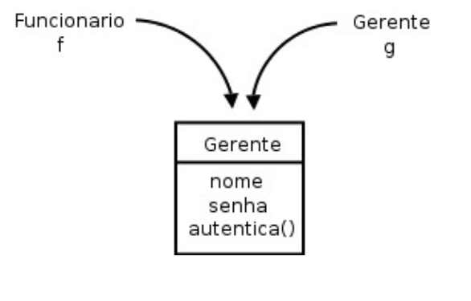

- [HERANÇA, REESCRITA E POLIMORFISMO](#herança-reescrita-e-polimorfismo)
  - [9.1 REPETINDO CÓDIGO?](#91-repetindo-código)
    - [SUPER E SUB CLASSE](#super-e-sub-classe)
    - [SEMPRE USAR PROTECTED?](#sempre-usar-protected)
  - [9.2 REESCRITA DE MÉTODO](#92-reescrita-de-método)
    - [A ANOTAÇÃO @OVERRIDE](#a-anotação-override)
  - [9.3 INVOCANDO O MÉTODO REESCRITO](#93-invocando-o-método-reescrito)
  - [9.4 POLIMORFISMO](#94-polimorfismo)
  - [9.5 UM OUTRO EXEMPLO](#95-um-outro-exemplo)

## HERANÇA, REESCRITA E POLIMORFISMO
### 9.1 REPETINDO CÓDIGO?
Como toda empresa, nosso banco tem funcionários. Modelemos a classe  Funcionario :
```java
public class Funcionario {
private String nome;
private String cpf;
private double salario;
// métodos devem vir aqui
    }
```
Além  de  um  funcionário  comum,  há  também  outros  cargos,  como  os  gerentes;  estes  guardam  a
mesma informação que um funcionário  comum, mas também têm outros dados  e funcionalidades um
pouco  diferentes.  Por  exemplo,  um  gerente  no  nosso  banco  tem  uma  senha  numérica  que  permite  o
acesso ao sistema interno do banco, além do número de funcionários os quais ele gerencia:
```java
public class Gerente {
    private String nome;
    private String cpf;
    private double salario;
    private int senha;
    private int numeroDeFuncionariosGerenciados;

    public boolean autentica(int senha) {
        if (this.senha == senha) {
            System.out.println("Acesso Permitido!");
            return true;
        } else {
            System.out.println("Acesso Negado!");
            return false;
        }
    }
}
```

Existe um jeito, em Java, de relacionarmos uma classe de tal maneira que uma delas herda tudo que
a outra tem. Isso é uma relação de classe mãe e classe filha. No nosso caso, gostaríamos de fazer com
que o  Gerente  tivesse tudo que um  Funcionario  tem, gostaríamos que ela fosse uma extensão  de
 Funcionario . Fazemos isso por meio da palavra-chave  extends .

```java
public class Gerente extends Funcionario {
private int senha;
private int numeroDeFuncionariosGerenciados;
public boolean autentica(int senha) {
if (this.senha == senha) {
                System.out.println("Acesso Permitido!");
return true;
            } else {
                System.out.println("Acesso Negado!");
return false;
            }
        }
// setter da senha omitido
    }
```

Em  todo  momento  que  criarmos  um  objeto  do  tipo   Gerente ,  este  terá  também  os  atributos
definidos na classe  Funcionario , pois um  Gerente é um  Funcionario 

```java
public class TestaGerente {
public static void main(String[] args) {
            Gerente gerente = new Gerente();
// podemos chamar métodos do Funcionario:
            gerente.setNome("João da Silva");
// e também métodos do Gerente!
            gerente.setSenha(4231);
        }
    }
```
Dizemos que a classe  Gerente herda todos os atributos e métodos da classe mãe, no nosso caso, a
 Funcionario . Para ser mais preciso,  ela também herda os  atributos  e métodos privados, porém não
consegue  acessá-los  diretamente.  Para  acessar  um  membro  privado  na  filha  indiretamente,  seria
necessário que a mãe expusesse um outro método visível que invocasse esse atributo ou método privado

#### SUPER E SUB CLASSE
A  nomenclatura  mais  encontrada  é  que   *Funcionario*   é  a  **superclasse**  de   *Gerente* ,  e
 *Gerente*   é  a  **subclasse**  de   *Funcionario*

E  se  precisamos  acessar  os  atributos  que  herdamos?Existe um outro modificador de acesso, o  **protected** , o qual fica entre o  **private**   e  o
 **public** . Um atributo  **protected**  só pode ser acessado (visível) *pela própria classe*, suas subclasses e
classes encontradas no mesmo pacote
```java
public class Funcionario {
protected String nome;
protected String cpf;
protected double salario;
// métodos devem vir aqui
    }
```
#### SEMPRE USAR PROTECTED?
Então por que usar  private ? Depois de  um tempo  programando  orientado  a  objetos,  você
começará  a sentir  que  nem sempre  é  uma  boa ideia  deixar  a  classe filha  acessar  os  atributos  da
classe mãe, pois isso quebra um pouco a percepção de que só aquela classe deveria manipular seus
atributos. 

Da  mesma  maneira,  podemos  ter  uma  classe   Diretor   que  estenda   Gerente ,  e  a  classe
 Presidente  pode estender diretamente de  Funcionario .
Fique  claro  que  essa  é  uma  decisão  de  negócio.  Se   Diretor   estenderá  de   Gerente   ou  não,
dependerá se, para você,  Diretor é um  Gerente .
Uma classe pode ter várias filhas, mas apenas uma mãe. É a chamada herança simples do Java.


### 9.2 REESCRITA DE MÉTODO
Todo fim de ano, os funcionários do nosso banco recebem uma bonificação. Os funcionários comuns
recebem 10% do valor do salário e os gerentes, 15%.
Vejamos como fica a classe  Funcionario :
```java
public class Funcionario {
protected String nome;
protected String cpf;
protected double salario;
public double getBonificacao() {
return this.salario * 0.10;
        }
// métodos
    }
```
Se deixarmos a classe  Gerente  como está, ela herdará o método  getBonificacao .
```java
Gerente gerente = new Gerente();
gerente.setSalario(5000.0);
System.out.println(gerente.getBonificacao());
```
O resultado  aqui  será  500. Não  queremos  essa resposta,  pois  o  gerente  deveria  ter  750  de  bônus
nesse  caso.  Para  consertar  isso,  uma  das  opções  seria  criar  um  novo  método  na  classe   Gerente 
chamado,  por  exemplo,   getBonificacaoDoGerente .  O  problema  é  que  teríamos  dois  métodos  em
 Gerente ,  confundindo  bastante  quem  for  usar  essa  classe,  além  disso,  cada  um  dá  uma  resposta
diferente
No Java, quando herdamos um método, podemos alterar seu comportamento. Podemos reescrever
(reescrever, sobrescrever, override) esse método:
```java
public class Gerente extends Funcionario {
    int senha;
int numeroDeFuncionariosGerenciados;
public double getBonificacao() {
return this.salario * 0.15;
        }
// ...
    }
```
Agora o método está correto para o  Gerente . Refaça o teste e veja que o valor impresso é o correto
(750):
```java
Gerente gerente = new Gerente();
gerente.setSalario(5000.0);
System.out.println(gerente.getBonificacao());
```
#### A ANOTAÇÃO @OVERRIDE
Há como deixar explícito no seu código que determinado método é a reescrita de um método da
classe mãe  dele. Podemos fazê-lo  colocando  @Override   em  cima  do método. Isso  é  chamado
anotação. Existem diversas anotações, e cada uma terá um efeito diferente sobre seu código.
```java
@Override
public double getBonificacao() {
return this.salario * 0.15;
}
```

### 9.3 INVOCANDO O MÉTODO REESCRITO
Depois de reescrito, não podemos mais  chamar o método  antigo que fora herdado da  classe mãe:
realmente  alteramos  o  seu  comportamento.  Mas  podemos  invocá-lo  no  caso  de  estarmos  dentro  da
classe.
Imagine que, para calcular a bonificação de um  Gerente , devamos fazer igual ao cálculo de um
 Funcionario , porém adicionando R$ 1000. Poderíamos fazer assim:
```java
public class Gerente extends Funcionario {
int senha;
int numeroDeFuncionariosGerenciados;
    public double getBonificacao() {
    return this.salario * 0.10 + 1000;
    }
// ...
    }
```
Aqui teríamos um problema: o dia que o  getBonificacao  do  Funcionario  mudar, precisaremos
mudar  o  método  do    Gerente    a  fim  de  acompanhar  a  nova  bonificação.  Para  evitar  isso,  o
 getBonificacao  do  Gerente  pode chamar o do  Funcionario  utilizando a palavra-chave  super .
```java
public class Gerente extends Funcionario {
int senha;
int numeroDeFuncionariosGerenciados;
public double getBonificacao() {
return super.getBonificacao() + 1000;
        }
// ...
    }
```
### 9.4 POLIMORFISMO

O que guarda uma variável do tipo  Funcionario ? Uma referência para um  Funcionario , nunca o
objeto em si.
Na herança, vimos que todo  Gerente  é um  Funcionario , pois é uma extensão deste. Podemos
nos  referir  a  um   Gerente   como  sendo  um   Funcionario .  Se  alguém  precisa  falar  com  um
 Funcionario  do banco, pode falar com um  Gerente ! Por quê? Pois,  Gerente é um  Funcionario .
Essa é a semântica da herança
```java
Gerente gerente = new Gerente();
Funcionario funcionario = gerente; 
funcionario.setSalario(5000.0);
```


*Polimorfismo*  é  a  capacidade  de  um  objeto  poder  ser  referenciado  de  várias  formas  (cuidado,
polimorfismo não quer dizer que o objeto fica se transformando, muito pelo contrário, um objeto nasce
de um tipo e morre daquele tipo, o que pode mudar é a maneira como nos referimos a ele).

Até aqui tudo bem, mas e se eu tentar:
```java
funcionario.getBonificacao();
```
Qual é o retorno desse método? 500 ou 750? No Java, a invocação de método sempre será decidida
em tempo de execução. Apesar de estarmos nos referenciando a esse  Gerente  como sendo um  Funcionario , o
método executado é o do  Gerente . O retorno é 750.

Parece  estranho  criar  um  gerente  e  referenciá-lo  como  apenas  um  funcionário.  Por  que  faríamos
isso? Na verdade, a situação que costuma aparecer é a que temos um método que recebe um argumento
do tipo  Funcionario :

```java
class ControleDeBonificacoes {
private double totalDeBonificacoes = 0;
    public void registra(Funcionario funcionario) {
    this.totalDeBonificacoes += funcionario.getBonificacao();
        }
    public double getTotalDeBonificacoes() {
    return this.totalDeBonificacoes;
        }
    }
```
E em algum lugar da minha aplicação (ou no  main , se for apenas para testes):
```java
ControleDeBonificacoes controle = new ControleDeBonificacoes();
Gerente funcionario1 = new Gerente();
funcionario1.setSalario(5000.0);
controle.registra(funcionario1);
Funcionario funcionario2 = new Funcionario();
funcionario2.setSalario(1000.0);
controle.registra(funcionario2);
System.out.println(controle.getTotalDeBonificacoes());
```

Qual  será  o  valor  resultante?  Não  importa  que  dentro  do  método    registra    o
 ControleDeBonificacoes  receba  Funcionario . Quando ele receber um objeto que realmente é um
 Gerente , o seu método reescrito será invocado. Reafirmando: não importa como nos referenciamos
a um objeto, o método a ser invocado é sempre o do próprio objeto

### 9.5 UM OUTRO EXEMPLO
Imagine que modelaremos um sistema para a faculdade que controle as despesas com funcionários e
professores. Nosso funcionário fica assim:
```java
public class EmpregadoDaFaculdade {
private String nome;
private double salario;
public double getGastos() {
return this.salario;
        }
public String getInfo() {
return "nome: " + this.nome + " com salário " + this.salario;
        }
// métodos de get, set e outros
    }
```
O gasto que temos com o professor não é apenas o seu salário. Temos de somar um bônus de dez
reais por hora/aula. O que fazemos então? Reescrevemos o método. Da mesma forma que o  getGastos 
é diferente, o  getInfo  também o será, pois temos de mostrar as horas/aula também.
```java
public class ProfessorDaFaculdade extends EmpregadoDaFaculdade {
private int horasDeAula;
public double getGastos() {
return this.getSalario() + this.horasDeAula * 10;
        }
public String getInfo() {
            String informacaoBasica = super.getInfo();
            String informacao = informacaoBasica + " horas de aula: "
 + this.horasDeAula;
return informacao;
        }
// métodos de get, set e outros que forem necessários
    }
```
A novidade  aqui  é  a  palavra-chave  super . Apesar  do método ter sido reescrito,  gostaríamos  de
acessar  o método  da  classe mãe  para  não  ter  de  copiar  e  colocar  o  conteúdo  desse método  e  depois
concatenar com a informação das horas de aula.
Como tiramos proveito do polimorfismo? Imagine que tenhamos uma classe de relatório:
```java
public class GeradorDeRelatorio {
public void adiciona(EmpregadoDaFaculdade f) {
            System.out.println(f.getInfo());
            System.out.println(f.getGastos());
        }
    }
```

Suponhamos  que  um  certo  dia,  muito  depois  de  terminar  essa  classe  de  relatório,  resolvêssemos
aumentar nosso sistema e colocar uma classe nova que representa o  Reitor . Como ele também é um
 EmpregadoDaFaculdade , será  que  precisaríamos  alterar  algo  na nossa  classe  de  Relatorio ? Não.
Essa  é  a ideia!

```java
public class Reitor extends EmpregadoDaFaculdade {
// informações extras
public String getInfo() {
return super.getInfo() + " e ele é um reitor";
        }
// não sobrescrevemos o getGastos!!!
    }
```
